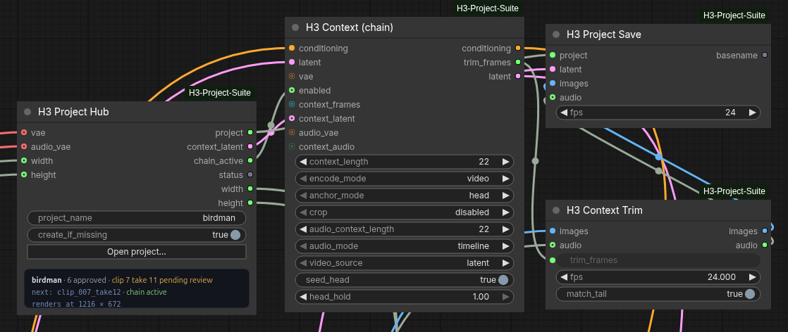
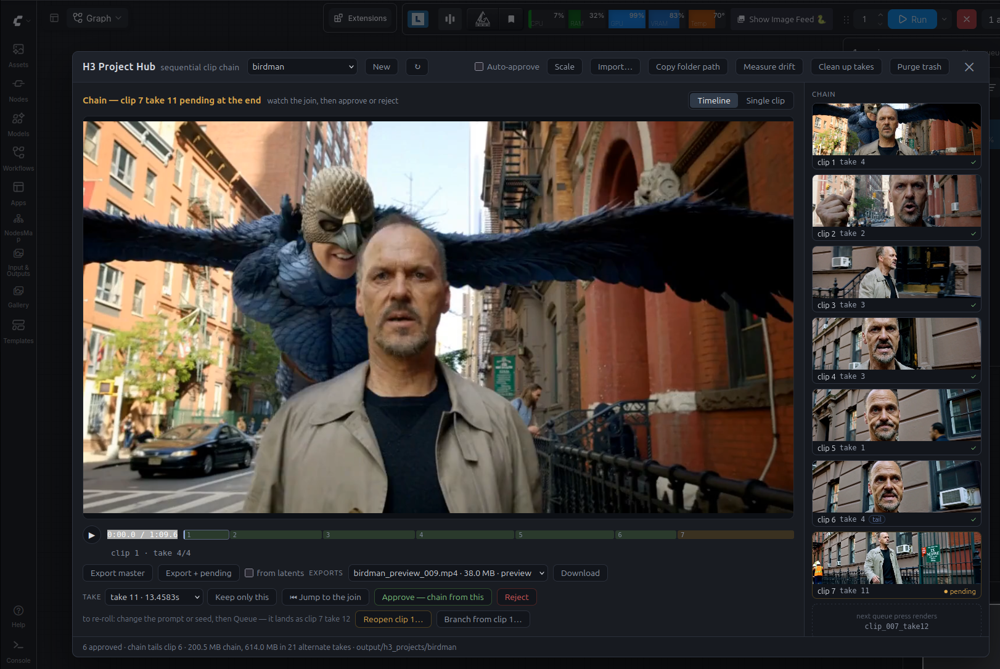

# H3 Project Suite

**Make long videos with MiniMax H3, one clip at a time, without the joins falling apart.**

H3 makes great five-to-fifteen second clips. Stringing them into something longer is where it gets painful: the usual trick is to take the last frame of one clip and use it as the first frame of the next, which throws away everything except a single still. Motion stops and restarts. The soundtrack cuts out and something vaguely similar starts up. And because every join converts the video out of the model's format and back in again, each one costs a little quality that the next join then builds on.

This suite fixes that, then wraps a project manager around it so you aren't hand-managing files between every clip.

The short version of how: in its default *latent* mode, each clip is handed to the next one in the model's own internal format rather than as pictures and sound. There's no decoding between clips, so the handoff doesn't cost you a conversion the way traditional extension methods do. It isn't magic — the model still does what the model does — but the quality loss that comes from the plumbing is largely removed, which should let you go further before a chain starts looking tired. You never have to think about this; it's just the default.

**A context window manager that gets out of your way to make things easy.**

The idea is simple — create and automate your video extensions without getting in your way. Instead of trying to be a full-blown all-in-one node, this one is focused to handle the technical complexities of managing clips without disrupting your favorite workflow. Use your own prompt editors, media loaders, and custom nodes that you know and love. Then once your run is done, open the project manager, review, compare takes, approve for the next clip, and move on. Once you're done, a one-click export dumps your finished output into your project folder. No fluff.

(Although I do recommend checking out my [Prompt Builder and Media Management suite](https://github.com/Adudeguyman/ComfyUI-Fantastic-MiniMaxH3-PromptBuilder) and [Fantastic Loras](https://github.com/Adudeguyman/comfyui_fantastic-loras).)



*The humble nodes that sit in your workflow, giving you a quick reference to the current chain's status without taking up space.*



*The pop-up project manager. Easy to use, and stays out of your way.*

---

## What's new

**1.5.1**
- The project panel now works inside SwarmUI. Before, every button in the panel failed there with a "missing or stale session token" error.

**1.5.0**
- **Sound in the drift report.** Measure drift now tracks loudness, hiss and the high end of each clip's sound as well as the picture, so a voice wearing down over a chain shows up as a number instead of a hunch.
- **Anchor latent.** An experimental Hub output that feeds clip 1's sound to every later clip as a reference, to keep voices sounding like themselves down a long chain. It works from the project's own files, so it covers invented voices and scenes with several people talking. One wire from the Hub to H3 Context.
- Fixed chained clips failing with a shape mismatch when an audio reference is wired and an older copy of H3 Motion Context is also installed.

**1.4.2**
- **Hold framing.** An experimental toggle on H3 Context that keeps the previous shot's framing going after the overlap ends, instead of letting the model cut to a new angle at that point. Off by default; it can leave a slight ghost at the seam, so try fixing the prompt first.
- Click the status box on the Hub node to open the project panel.

**1.4.1**
- **Download an export.** Every master the project has written now shows up in a dropdown beside the export buttons, with a Download button. Handy when your ComfyUI runs somewhere you can't get at the output folder.

**1.4.0**
- **Import your own footage.** Bring in a live-action plate, a clip from another model, or an old master, pick the part you want on a filmstrip, and it lands as a clip in the chain.
- **Export from latents.** A toggle that rebuilds the master from the saved latents, so every frame is encoded once and joins come out cleaner. Slower, but it's the one to use for the finished thing.
- **One picture size per project.** The Project Hub now takes and gives out width and height, so a whole chain renders at the same size and imported footage is fitted to it. If a Resolution Selector disagrees with the project, the Hub tells you in red before you queue.
- **Scale the panel** to your screen, with separate window and text sizes.
- **Security hardening** for the Comfy Registry's review policy. Nothing changes in how you use the pack; the details are in [SECURITY.md](SECURITY.md).

See [CHANGELOG.md](CHANGELOG.md) for the full history.

---

## What you get

**Clips that continue instead of restarting.** The next clip is handed roughly a second of what came before rather than one frozen frame, so motion carries its direction and speed through a join, and sound carries on — the same music playing through, the same voice mid-sentence — rather than a soundalike starting up. How well any individual join lands still depends on your prompt and the model's mood, but it has something real to continue from.

**Minimal quality loss between clips.** In latent mode there's no decoding between clips — the handoff never leaves the model's own format — so there's less quality loss than with traditional extension methods, where every join costs another conversion. Some variation between clips is still normal; this is a generative model. But the losses that come from the plumbing rather than the model are largely off the table.

**References that survive.** If you're using Ref2VA with a voice reference and character images, they keep working on every clip, not just the first one.

**A project, not a pile of files.** Every chain lives in one folder with its own clips, its own history, and a record of what continues from what. No filename schemes, no index numbers to keep straight.

**A review screen.** After each render, watch the new clip *in the context of everything before it* on a scrubbable timeline, then approve it or throw it away. Approving is what tells the next render where to continue from.

**Takes.** Don't like a clip? Change your prompt and render again. Both versions are kept, and you pick between them by watching, not by guessing from filenames.

**Branching.** Fifteen clips in and you want to try a different direction from clip six? Branch there into a brand new project. The original is left completely alone — and you can even branch from a take you never approved.

**Export.** One button stitches your approved clips into a single video. It never overwrites; it suggests the next free filename.

---

## Install

1. Put the folder in `ComfyUI/custom_nodes/`.
2. Restart ComfyUI.
3. Hard-refresh your browser (Ctrl+Shift+R).

Exporting a master, levelling a join and measuring drift need `av` and `numpy`, which ComfyUI itself already depends on — nothing else, and no `ffmpeg` on your PATH. The panel talks to the server over a handful of `/h3_suite/` routes; every one that changes anything is guarded by a per-session token and a same-origin check, described in [SECURITY.md](SECURITY.md).

**Important:** if you have the original *ComfyUI-H3-Motion-Context* pack installed, remove or disable it. The two can't run at the same time — this one detects the conflict and refuses to run rather than produce a bad render.

---

## The four nodes

You wire these up once, then never touch them again.

| Node | What it does |
| --- | --- |
| **H3 Project Hub** | Your control panel. Pick a project, review clips, approve, branch, export. |
| **H3 Context** | Does the actual joining. Set once, forget. |
| **H3 Context Trim** | Removes the overlap at the start of each new clip. Set once, forget. |
| **H3 Project Save** | Saves each finished clip into the project. |

Three connections do the whole job:

```
H3 Project Hub ──context_latent──▶ H3 Context ──conditioning──▶ your guider
               ──chain_active────▶ H3 Context ──trim_frames───▶ Trim
               ──project─────────▶ H3 Project Save
```

Then the normal path: sampler ➜ decode ➜ **Trim** ➜ **Project Save**.

H3 Context's `latent` output goes to your sampler's `latent_image`, in place of the wire from the MiniMax node. That's what lets the **seed head** setting work; both example workflows are already wired this way.

---

## How you actually use it

**1. Name a project.** Type a name on the Hub node, or hit *New* in the panel. That's the whole setup.

**2. Queue.** Clip one renders like any normal H3 job. Nothing to bypass, no switches to flip — the Hub knows this is the first clip and stays out of the way.

**3. Review.** Click **Open project…** on the Hub node. Your clip is sitting there, ready to play.

**4. Approve.** If you like it, hit **Approve**. That makes it the thing the next clip continues from.

**5. Change your prompt and queue again.** Clip two renders, continuing clip one. It appears in the panel with the playhead parked just before the join, so the first thing you see is whether the transition works.

**6. Repeat.** That's the loop: queue → watch → approve → queue.

If you queue *without* approving, you get another take of the same clip instead of moving forward — exactly what you want while you're still fiddling with a prompt. A dropdown lets you switch between takes and watch each one.

---

## The review panel

Everything lives in one screen, opened from the Hub node.

**Timeline** plays your whole chain as one continuous video, with a scrub bar divided into clips — green for approved, amber for the one awaiting your decision. Drag anywhere to jump. **⏮ Jump to the join** snaps you back to the moment before the newest clip starts, which is usually the only part you need to see.

Under the transport it names what you're watching: `clip 7 · take 9/11` — take nine is the one in the chain, out of eleven that exist. It also says `pending` for a clip you haven't decided on yet, and `levelled` when that join is set to be corrected on export. Hovering gives the filename and which clip it continues from.

**Single clip** mode plays one clip on its own when you want a closer look.

**The rail** down the right side lists every clip with a thumbnail. Click one to jump there.

**Approve / Reject** decide the newest clip's fate. Rejected clips go to a trash folder inside the project, so a hasty click isn't fatal.

**Reopen** lets you go back and redo an earlier clip. It tells you exactly which later clips get dropped before you commit, since everything after it was built on it.

**Branch from clip N…** opens a second screen showing what the new chain would look like, ending on whichever version of that clip you choose. Watch it, name it, create it. Your original project doesn't change at all.

**Export master** stitches your approved clips into one file. **Export + pending** includes the clip you haven't approved yet — the best way to judge a join, since the preview player has a tiny hitch between clips that a real export doesn't.

---

## Housekeeping

Extra takes add up: each one is a full video plus the data the next clip needs. The panel footer always tells you where the space is going.

```
6 approved · 30.0s total · 2.1 GB chain, 840 MB in 6 alternate takes
```

**Clean up takes** moves every alternate take into the project's trash. Your chain isn't touched. Takes in the trash can still be branched from, so this is safe to do whenever the folder gets messy.

**Purge trash** is the permanent delete. It tells you how much it's about to remove first. After that, those takes are gone for good.

---

## Importing clips to extend

One wiring step first: connect your H3 video and audio VAEs to the **Project Hub** node's `vae` and `audio_vae` inputs. They aren't used to render anything — the panel reads which loaders they come from, so importing knows which models to encode with without anything having to run. Wire your **Resolution Selector** into the Hub's `width` and `height` as well, so the project has a picture size before its first clip arrives.

Press **Import…** in the panel to bring in outside footage — a live-action plate, a clip from another model, an exported master you want to continue — as the chain's first clip. Drop a video anywhere on the import window, or press **Choose…** and pick one from your computer. It's copied into ComfyUI's input folder and selected; anything already in there shows up in the list too.

Because of how the MiniMax H3 VAE encoder works, you may lose some frames from importing a video. H3 renders at 24 fps and only in certain lengths, so a clip that isn't already one of those lengths is trimmed to the nearest one that is — never more than a fraction of a second, and only ever from the ends. Footage at another frame rate is converted to 24 fps first by picking real frames, never by blending them.

You choose which frames to keep by looking at them. The import window shows a filmstrip of the whole source with the kept span lit and the dropped ends dimmed. Drag the span along the footage, scrub the video underneath, and press **Play window** to watch only what you're keeping. The **length** picker offers just the lengths H3 can render, so an invalid window can't be chosen. It starts on the longest valid window at the *end* of the footage, since an imported clip usually leads into a chain.

If the footage isn't the project's picture size, a crop box appears over the preview showing what survives. Drag it to choose, or switch to **Fit** to keep the whole frame with bars instead.

Audio comes along when the file has it. The imported clip lands as clip 1, pending review, so you watch it in the player like any other take before approving.

There's also an **H3 Import Source** node for doing this in a graph, with the same conforming and a written report instead of a filmstrip.

---

## Exporting from latents

Next to the export buttons is a **from latents** toggle. Toggled off, the generated mp4 clips are encoded quickly and directly. Toggled on, the exporter decodes all of the clip's latent files into one saved mp4, as if it were generated in one pass.

Exporting with **from latents** on can take a long time to process, however with level matching before anything is written this can provide a cleaner, more seamless output. With it off it is very quick, but may have more noticeable seams or color shifts, so that is better for an overall preview as you go for a quick progress check.

There is a **quality** toggle for exporting the full chain in **from latents** mode: High (CRF 16) by default, Archive (CRF 14, slower) when it's the finished thing, or Quick (CRF 18) for a look. The review clips are encoded separately and aren't affected — they're deliberately cheaper now, since the master no longer comes from them.

Both settings are remembered in your browser.

Every master the project has written appears in an **exports** dropdown beside the export buttons, newest first, with a **Download** button. That is how to get a master out when ComfyUI runs somewhere you can't browse the output folder — a hosted service, a remote box — since the file otherwise only exists on the server's disk.

---

## On a big monitor

The panel has a **Scale** control in its top bar, with two separate sliders.

**Window** makes the box bigger. **Text** changes type size only, so the layout rewraps and you get more readable words rather than fewer of them — which is why these are two controls and not one zoom.

Set them, press Apply. It doesn't apply as you drag on purpose: the control sits inside the window it resizes, so a live update would move the slider out from under your pointer mid-drag. Reset puts both back to 100%.

Your setting is remembered in your browser, not in the workflow — it's a property of your monitor, not of the project, so sharing a workflow doesn't ship your 200% to everyone else.

---

## Skipping review

Normally a finished render waits for you: it sits as pending, and queueing again re-rolls it rather than moving on. **Auto-approve**, in the panel's top bar, turns that off for one project — each render is approved as it arrives and the next queue extends the chain instead.

It is per project, remembered in the project file, and off unless you turn it on. Turning it on asks first; turning it off does not.

While it is on you cannot miss it: a red line across the panel, a red line on the node, and a warning in the ComfyUI log on every render. That is deliberate — a chain that grew twelve clips nobody looked at is a bad surprise.

Your takes are still kept. An auto-approved clip can be reopened and re-rolled like any other, so the gate is what gets skipped, not the history.

---

## Measuring drift

Each clip is built on the previous clip's output, so small changes compound: exposure wanders, texture softens. **Measure drift** in the Hub samples every clip in the chain and reports how the picture moves from the first clip to the last, as a total and as a rate per clip, with a bar per clip for whichever moved most: brightness, contrast, sharpness and colour. If the clips have sound it reports that too, in its own section — how loud they are, how bright the sound is, how much of it sits above 4 kHz, and how much hiss is under the quiet moments. A voice getting worse down a chain shows up as the hiss and the high end creeping up together.

These numbers also move when the content changes — a clip that cuts to a dark interior is genuinely darker. Read the trend across a run of clips in one continuous scene, not any single value.

If the trend is steep, the cheapest fix isn't a setting: a deliberate cut to a new angle re-derives the look from your references and prompt instead of inheriting it, which resets most of the accumulation.

---

## Levelling a join

Sometimes a clip opens slightly brighter than the one before it and settles back over a second or so. It happens where the new clip stops being held to the old one and relaxes toward its own exposure.

**Level-match join** (next to Reopen when you're on a clip) measures that step and tells you what it found before you commit — how big the step is, and how long it takes to settle. Turn it on and the export corrects that clip's opening so it meets the previous one, fading the correction out as the clip settles.

It's per join, because joins differ: one may need it and the next may be fine. Your clips are never modified — only the exported master. An export containing a corrected join is re-encoded rather than copied, so it takes longer than a plain one.

---

## Settings worth knowing

Almost everything can be left alone. Three are worth understanding:

**Context length (22)** — how much of the previous clip gets handed over. It's a dropdown of the only values that exist: 1, 5, 22, 39 and 56. Bigger means a smoother join but less new footage per render — at 56, nearly two and a half seconds of the new clip re-tread the old one. 22 (just under a second) is a good default, and it's worth changing per clip: a slow push-in benefits from 39 or 56 where a fast cut doesn't.

**Video source (latent)** — the default, and the mode that skips the decoding step between clips as described at the top. `frames` is the older way of doing it, kept for compatibility with hand-built graphs.

**fps (24)** — must match your video's frame rate. H3 runs at 24, so leave it unless you know you've changed something.

**Seed head (on)** — normally the carried-over frames are given to the model as something to *agree with*: it generates the new clip from scratch and is steered toward matching them. With this on, those frames are also written directly into the clip's starting point and held there while it renders, so the model builds forward from the previous clip's actual content instead of from noise that merely resembles it.

This needs the sampler's latent to come from **H3 Context's `latent` output** rather than straight from the MiniMax node. Both example workflows are wired that way. If you built your graph by hand and the sampler still takes its latent from the MiniMax node, this setting does nothing — no harm, just no effect.

If a join shows a texture or quality change about a second in, that's the point where the held frames end. **Head hold (1.0)** controls how firmly they're held; try 0.85, or switch seed head off to compare.

**Hold framing (off)** — experimental. Stops the shot from jumping to a new framing the moment the carried-over frames run out. The overlap tells the model what the first second looks like, but not that the shot has to keep going afterwards, so it can cut away right there. This holds the framing one step longer so it carries through, but may also cause a slight ghosting effect. Try it on a join that jumps; if a continuous shot jumps to a new angle right after the overlapped frames this may help, but try fixing the prompt first before accepting possible ghosting at the seam that can be caused by this feature.

**Anchor latent (unwired)** — experimental, for a voice that drifts down a chain. Each clip's sound is generated from the previous clip's generated sound, so the model keeps continuing its own approximation and a character slowly stops sounding like themselves. Wire the Hub's **anchor_latent** output here. That is clip 1's saved latent, the only link in the chain that wasn't already continuing a copy, and its sound is given to the model as a reference on every clip so the voices are pulled back to how the scene actually sounded instead of to last clip's slightly worse version. Nothing has to exist outside the project: it works for two people talking, or for a voice the model invented that you have no recording of. No audio VAE, one wire. The first ten seconds are used, the carried-over tail still continues the sound, and the prompt can't refer to the anchor by tag. Use **Measure drift**, which now reports sound as well as picture, to see whether it helped.

On a ComfyUI new enough to place keyframe anchors itself, seed head runs at **full strength**: the pack carries the mechanism from upstream pull request [#15375](https://github.com/Comfy-Org/ComfyUI/pull/15375) (not merged yet) as a runtime layer, vendored from the [MultiRef fork](https://github.com/seitanism/ComfyUI-H3-Motion-Context-MultiRef). Held frames read as *given* content from the first sampling step, and head hold grades the conditioning itself, not just the picture. Nothing on disk changes: the layer loads into memory when seed head first runs, a restart reverts it, and if ComfyUI ever ships this natively the pack detects that and steps aside. The log says which form you got. On older ComfyUI builds seed head keeps its simpler form — the held frames land exactly, they just steer the model more weakly.

---

## If you update ComfyUI

Two of this pack's fixes went upstream in ComfyUI on 13 August 2026 ([#15439](https://github.com/Comfy-Org/ComfyUI/pull/15439)): interior keyframe anchors, and letting keyframes and references coexist instead of references quietly winning.

Nothing to do about it. On a ComfyUI that has them, the pack notices and steps back from the video side, keeping only the audio timeline placement — that part is this pack's own and was never upstreamed. On an older ComfyUI it patches as before. Either way it logs what it decided, and the check is on what your build actually does rather than a version number, so it stays right through rebases and backports.

**If joins started jumping a frame or two after a ComfyUI update**, update the pack — that was this pack handing the new ComfyUI a placeholder frame number it no longer needed, which stacked the carried-over frames on the opening instead of spreading them across the overlap. Fixed.

**On ComfyUI 0.34 and newer** the pack patches nothing at all - core places interior anchors and keyframe audio itself, and the nodes just hand it plain keyframes. Older builds keep working exactly as before; the pack probes what the running core can do and picks the right path by behaviour, not by version number.

**Running this alongside another H3 motion-context pack** is fine. Several packs descend from the same ancestor and all adjust ComfyUI's layout the same way; whichever loads first does the job, and the others recognise it and leave it alone. The node names don't collide either, so both appear in your menu. What you should not do is wire both into the same chain — pick one to manage a given project.

**If the pack reports that it could not patch the layout**, read the log line just above the error: it names whichever module currently owns ComfyUI's layout. If that isn't ComfyUI itself, another pack has claimed it, and `tests/who_patched_layout.py` (run from your ComfyUI folder) will tell you which one.

---

## Things to know before you start

**Pick your resolution first.** A chain is locked to the size of its first clip. Want a different aspect ratio? Start a new project.

**Approve is what moves you forward.** Nothing advances until you approve. That's on purpose: a clip you haven't looked at should never become the foundation for the next five.

**Your projects survive everything.** Restart ComfyUI, close the browser, load a different workflow — the project lives on disk, not in the graph. Come back tomorrow and pick up where you left off.

**Clips remember how they were made.** Each one is saved alongside the workflow and prompt that produced it, so you can drop an old clip back into ComfyUI and get its settings back.

---

## Where everything lives

```
ComfyUI/output/h3_projects/YourProject/
├── project.json          the chain's history
├── clips/                your clips, plus the latents that link them
│                         and a .json per take holding the prompt and
│                         workflow that made it
├── .trash/               rejected and cleaned-up takes
└── YourProject_master.mp4
```

Copy that folder to another machine and carry on there.

---

## Credits

Built on [NikoDemon80's ComfyUI-H3-Motion-Context](https://github.com/NikoDemon80/ComfyUI-H3-Motion-Context), which worked out how to make H3 continue clips at all. The multi-reference fix that keeps voices and character images alive across a chain came from [ethanfel's fork](https://github.com/ethanfel/ComfyUI-H3-Motion-Context), contributed by seitanism.

The full-strength form of seed head carries the mechanism from [drozbay's pull request #15375](https://github.com/Comfy-Org/ComfyUI/pull/15375), vendored from [seitanism's MultiRef fork](https://github.com/seitanism/ComfyUI-H3-Motion-Context-MultiRef) — both GPL-3.0, same lineage as the rest of this pack.

Everything talks to ComfyUI from the outside — no ComfyUI files are modified. If a future update changes something this relies on, the pack notices and stops rather than quietly producing bad renders.

Curious how the joining actually works, or why audio was the hard part? That's in [docs/HOW_IT_WORKS.md](docs/HOW_IT_WORKS.md).
