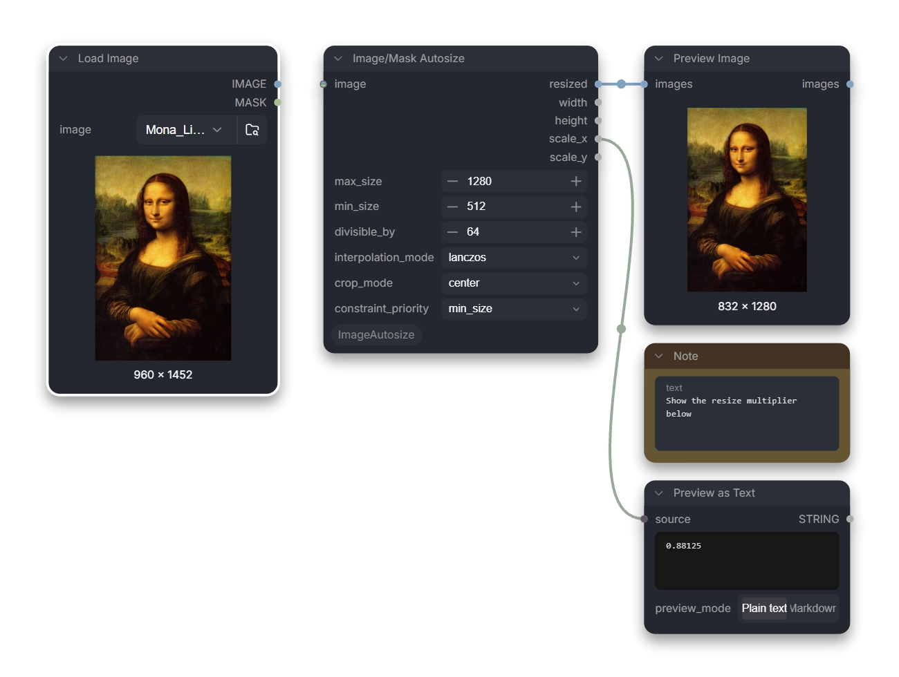

# ComfyUI-ImageAutosize

A set-and-forget image and mask resizer for diffusion workflows in
[ComfyUI](https://github.com/Comfy-Org/ComfyUI).

Image/Mask Autosize combines a longer-dimension target, a shorter-dimension
target, configurable constraint priority, and divisible output dimensions in
one operation. It also provides anchored cropping, reversible diffusion
padding, and reports the exact horizontal and vertical resize scales.



## Sizing behavior

The node calculates two aspect-preserving resize scales:

- The scale that makes the longer dimension equal `max_size`.
- The scale that makes the shorter dimension equal `min_size`.

`constraint_priority` determines which scale is used:

- `min_size`: Uses the larger scale. This is equivalent to applying `max_size`
  first and then enlarging as needed to enforce `min_size`. The shorter
  dimension wins when the constraints are incompatible.
- `max_size`: Uses the smaller scale. This is equivalent to applying `min_size`
  first and then shrinking as needed to enforce `max_size`. The longer
  dimension wins when the constraints are incompatible.

Both dimensions are then rounded to the nearest multiple of `divisible_by`.
This final rounding can move a dimension slightly beyond its nominal
constraint.

When `crop_mode` is an anchor such as `center` or `top_left`, the input is
resized to cover the calculated dimensions and then cropped from that
position. The aspect ratio is preserved.

When `crop_mode` is `none`, the input is resized directly to the calculated
dimensions. Divisibility rounding can therefore produce slightly different
horizontal and vertical scales.

When `crop_mode` is `pad`, the input is proportionally resized to fit inside
the calculated dimensions. Images use replicated edge padding and masks use
zero padding. The returned transform can be applied to aligned masks with
`Apply Autosize Transform`, then reversed after diffusion with
`Restore Autosized Image/Mask`.

## Inputs

- `image`: The `IMAGE` or `MASK` to resize.
- `max_size`: Target for the longer dimension.
- `min_size`: Target for the shorter dimension.
- `constraint_priority`: Selects whether `min_size` or `max_size` wins and
  whether the larger or smaller candidate resize scale is used.
- `divisible_by`: Rounds both output dimensions to the nearest multiple of this
  value.
- `interpolation_mode`: `nearest-exact`, `bilinear`, `area`, `bicubic`, or
  `lanczos`.
- `crop_mode`: `none`, `pad`, center, an edge, or a corner.

## Outputs

- `resized`: The resized value, with the same ComfyUI type as the input.
- `width`: Final output width.
- `height`: Final output height.
- `scale_x`: Actual intermediate resize width divided by the original width.
- `scale_y`: Actual intermediate resize height divided by the original height.
- `transform`: Recorded geometry for aligning related inputs and removing pad
  regions after diffusion.

For anchored cropping, `scale_x` and `scale_y` describe the resize performed
before the crop. A crop also introduces an offset, so apply the same settings
to related images and masks when their pixels must remain aligned.

## Image quality and device behavior

Image/Mask Autosize uses ComfyUI's shared resize implementation. Tensor-native
interpolation modes preserve the input device and dtype. ComfyUI's Lanczos
implementation uses Pillow internally but returns the result to the original
device and dtype.

## Relationship to Resize Image/Mask

ComfyUI's native `Resize Image/Mask` is the better choice for exact dimensions,
fixed multipliers, megapixel targets, or matching another input. Image/Mask
Autosize is focused on automatic diffusion sizing where longer-edge targeting,
shorter-edge constraints, explicit constraint priority, divisible dimensions,
anchored cropping, and scale metadata should happen together.

## Requirements

A recent ComfyUI build with V3 `MatchType` support is required. The extension
has no third-party dependencies beyond ComfyUI's existing requirements.

## Installation

Clone the repository into `ComfyUI/custom_nodes` and restart ComfyUI:

```bash
git clone https://github.com/SparknightLLC/ComfyUI-ImageAutosize.git
```

The node appears under `image`.

See [CHANGELOG.md](CHANGELOG.md) for migration notes.

---

This node was adapted from the `[img2img_autosize]` shortcode in
[Unprompted](https://github.com/ThereforeGames/unprompted).
