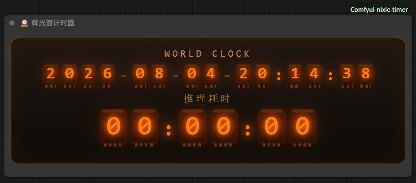

# ComfyUI Nixie Timer 🕰️

A Nixie-tube (辉光管) styled **world clock + inference timer** node for ComfyUI.

Drag the node into your workflow and it starts working immediately — no configuration needed.



## Features

- **Nixie-tube glow style** — classic orange vacuum-tube digits with electrode details, built in pure CSS
- **World clock** — live date & time in `YYYY-MM-DD-HH:MM:SS` format
- **Inference timer** — press **Queue / Queue Front** to start counting, stops automatically when the queue finishes (or on error)
- **Multi-language** — labels follow ComfyUI's UI language automatically (zh / en / ja / ko / ru / de / fr / es / pt / it)
  - Time is **kept after completion** (not reset) until you Queue again
- **Canvas-anchored** — the panel lives *inside* the node, moves/scales with the canvas like any normal node
- **Auto scale** — drag the node's border to scale the whole panel proportionally (text + background together)
- **Multiple instances** — add several nodes, each shows its own panel; timers stay in sync

## Installation

### Option 1: Clone (recommended)

```bash
cd ComfyUI/custom_nodes
git clone https://github.com/wul7chaos/Comfyui-nixie-timer.git
```

### Option 2: Manual copy

Copy the `Comfyui-nixie-timer` folder into `ComfyUI/custom_nodes/`.

Then **restart ComfyUI** (the extension is registered server-side on startup) and refresh the browser (`Ctrl+Shift+R`).

## Usage

1. In ComfyUI, double-click the canvas and search for **`NixieTimer`** (or **`辉光管`**) — category `utils`
2. Add it to the canvas — the panel appears automatically
3. Press **Queue** — the timer starts counting
4. When the run finishes, the timer stops and keeps the elapsed time
5. Delete the node to remove the panel

## Notes

- Requires a modern browser (Chromium / Firefox / Edge) — uses `ResizeObserver`, `pointer events`, CSS `transform`
- The node itself performs no computation (returns nothing); it is a pure UI element

## License

[MIT](LICENSE) — use it freely, commercially or personally, no restrictions.
