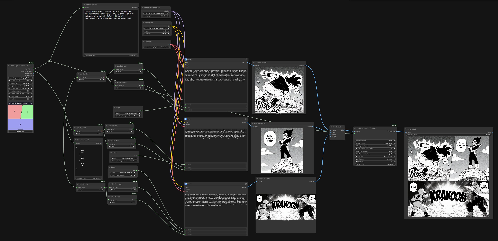

# ComfyUI-PanelComposer

> This `v2` tree is the Secure Nodes V2 edition. All authored layouts are
> private to the current user, and selected custom layouts travel with the
> workflow. See [SECURE_CONVERSION.md](SECURE_CONVERSION.md) for the security
> model, verification scope, and legacy-layout migration boundary.

Custom nodes for generating multi-panel manga/comic pages in ComfyUI: pick (or draw) a panel layout, get per-panel dimensions to feed your generation nodes, then composite the generated panel images back into one finished page.

## Nodes

| Node | Does |
|---|---|
| **Panel Layout Provider** | Outputs a layout's panel geometry (`layout_json`), a per-panel `(width, height)` list (`panel_dimensions`) sized to your target resolution, and a flat-color region map (`area_image` / `area_colors`) for regional conditioning. Shows a live preview of the page on the node itself. |
| **Panel Compositor** | Takes the generated panel images + `layout_json` and stitches them into one page, with configurable canvas size, fit mode (cover/contain/stretch/fit_to_shape), scaling algorithm, and gutters. |
| **List Get Item** | Indexes into a list/tuple (e.g. pull one panel's `(w, h)` out of `panel_dimensions`). |
| **Tuple Unpack** | Splits a tuple/list into up to 4 separate outputs (e.g. a panel's `(w, h)` into separate `width`/`height` sockets). |

## Parameters

### Panel Layout Provider

| Parameter | What it does |
|---|---|
| `layout_preset` | Which layout to use (grouped by category), or one you saved from the Draw Panels dialog. |
| `reading_order` | `left_to_right` / `right_to_left` — sets each panel's reading order (and the direction shown in the live preview). |
| `canvas_rotation` | Rotates the panel polygons only (0/90/180/270°) — the page's own shape doesn't rotate, panels just get repositioned within it. |
| `aspect_ratio` | The page's aspect ratio (e.g. `16:9`, `1:1`). |
| `page_orientation` | `portrait` or `landscape` — which way `aspect_ratio` points. |
| `canvas_size_mode` | `fixed_preset` (use `fixed_preset_size`) or `fixed_custom` (use `fixed_custom_megapixels`) to size the page. |
| `fixed_preset_size` | Page size preset (e.g. `1080p`, `2K`, `4K`), used when `canvas_size_mode` is `fixed_preset`. |
| `fixed_custom_megapixels` | Target page megapixels, used when `canvas_size_mode` is `fixed_custom`. |
| `megapixels` | Target megapixels for each **individual panel's** suggested size in `panel_dimensions` — separate from the page's own size above. |
| `multiple` | Rounds every computed width/height to the nearest multiple of this (e.g. `64`, for models that require dimensions divisible by 64). |

### Panel Compositor

| Parameter | What it does |
|---|---|
| `layout_json` | The layout from Panel Layout Provider (panel shapes + page size). |
| `images` | Generated panel images, in the same order as the layout's panels. Extra images are dropped; missing ones render as a numbered placeholder. |
| `canvas_mode` | How the output page is sized: `auto` (use `layout_json`'s own size), `fixed_preset` / `fixed_custom` (set it independently), or `scale_to_input` (derive it from one of the actual input images). |
| `aspect_ratio`, `fixed_preset_size`, `fixed_custom_megapixels` | Only used when `canvas_mode` isn't `auto` — same meaning as Panel Layout Provider's. |
| `page_orientation` | `auto` (follow the layout's own orientation) or force `portrait` / `landscape`. |
| `scale_to_input_mode` | When `canvas_mode` is `scale_to_input`: size the canvas off the `largest` or `smallest` input image. |
| `fit_mode` | How each image fills its panel — see below. |
| `scale_algo` | Resampling filter used whenever an image is resized: `nearest`, `bilinear`, `bicubic`, `lanczos`. |
| `gutter_px` | Width, in pixels, of the gap carved between adjacent panels. |
| `gutter_color` | Hex color used for gutters, and for any padding `contain`/`fit_to_shape` leaves behind. |

#### `fit_mode`: cover vs. contain vs. stretch vs. fit_to_shape

`cover`, `contain`, and `stretch` all fill the panel's rectangular **bounding box** first, and whatever doesn't belong to the panel's actual shape gets cropped away afterward. `fit_to_shape` skips that rectangle step entirely:

- **cover** — scales the image up/down, keeping its aspect ratio, until it fully covers the bounding box, cropping whatever overflows. No distortion, no padding.
- **contain** — scales the image down, keeping its aspect ratio, until it fits entirely inside the bounding box, padding the leftover space with `gutter_color`. No distortion, no cropping.
- **stretch** — resizes the image to exactly the bounding box's width and height, ignoring its original aspect ratio — so it squashes/stretches to fit. No cropping, no padding.
- **fit_to_shape** (**experimental**) — warps the image so its own corners and edges land directly on the panel's actual polygon vertices/edges, instead of filling a rectangle and cropping. On a plain rectangular panel this looks the same as `stretch`. The difference only shows on angled/non-rectangular panels (wedges, diagonals, notches): `cover`/`contain`/`stretch` still fill a rectangle and let the panel's angled edge slice through it, so part of the image gets cut off by that angle — `fit_to_shape` instead bends the whole image to follow the panel's edges, so the full image reads cleanly inside the odd shape with nothing sliced off. Only verified against the built-in presets — check the result if you use it on a custom/drawn shape.

### List Get Item

| Parameter | What it does |
|---|---|
| `list_or_tuple` | Any list/tuple-typed input (e.g. `panel_dimensions`). |
| `index` | Which element to return. Out-of-range values clamp to the nearest end instead of erroring. |

### Tuple Unpack

| Parameter | What it does |
|---|---|
| `tuple_or_list` | A list/tuple with up to 4 elements (e.g. one panel's `(width, height)`). |

Outputs `item_0`..`item_3`; positions beyond the input's length output `None`.

## How it works

1. **Panel Layout Provider** picks a layout preset (or a custom one you drew — see below) and computes each panel's target size for your chosen aspect ratio/resolution.
2. Use **List Get Item** / **Tuple Unpack** to route each panel's width/height into your own generation nodes (e.g. `EmptyLatentImage`), one generation per panel.
3. Feed all the generated panel images into **Panel Compositor** along with `layout_json` — it lays each image into its panel's shape and outputs the finished page.

## Example

See [`examples/`](examples/):


## Layout presets & custom layouts

Presets are grouped by category (Single, Splits, Grids, Diagonal, Wedge, Floating, Concave, Cascade, Splash, Strips, ...) and selectable straight from the **Panel Layout Provider** dropdown. You can also draw your own layout in-node (via the "Draw Panels" dialog) and save it as a reusable user preset — see [`ADDING_PRESETS.md`](ADDING_PRESETS.md) for details.

See [Parameters](#parameters) above for `fit_to_shape`'s caveat on custom/drawn shapes.

## Regional conditioning (experimental, theoretical)

`area_image`/`area_colors` from **Panel Layout Provider** exist to support regional conditioning: `area_image` is a flat-color map with one solid, distinct color per panel, and `area_colors` gives each panel's exact `0xRRGGBB` color in the same order — in theory that lets a mask node (e.g. an exact-color-match node) derive each panel's mask and feed it into a regional-conditioning setup (one prompt per panel region, single shared generation) instead of generating each panel separately.

This has **not** been gotten working end-to-end — treat it as an unverified starting point, not a supported workflow. In theory the wiring would look like:

```
Panel Layout Provider --area_image--> [exact-color-match / mask node] --mask--> [regional conditioning node] --+
                      --area_colors-->  (one iteration per panel/color)                                        |
                                                                                                                  v
                          [per-panel positive prompt] ---------------------------------------------> combined conditioning -> KSampler (single pass, full canvas)
```

## Installation

Clone/copy this folder into `ComfyUI/custom_nodes/`, restart ComfyUI. No extra dependencies beyond what ComfyUI already ships (Pillow).
