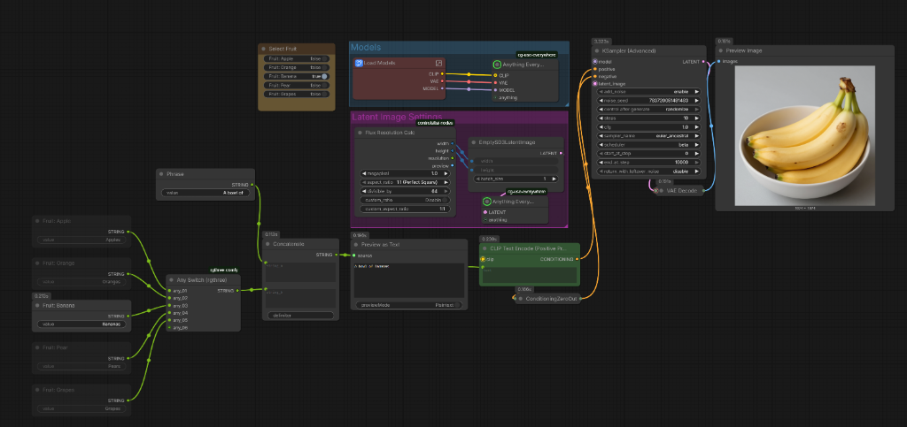

# ComfyUI Wireless Toggle Master

Control any nodes in your ComfyUI workflow by **title** or **color** matching. Toggle nodes on/off with a single click, with optional radio-button style restrictions.

## Features

- 🎯 **Wireless** - No connections needed! Control nodes anywhere in your workflow
- 🔍 **Regex Matching** - Filter nodes by title using regular expressions
- 🎨 **Color Matching** - Filter nodes by their node color
- 📦 **Subgraph Support** - Works across nested subgraphs
- 🔘 **Radio Mode** - Optional "max one" or "always one" restriction for exclusive selection

## Sample Workflow



*Example: Using Wireless Master Toggle to switch between fruit options with "always one" restriction*

📥 **[Download Sample Workflow](workflows/Toggle%20Master%20Sample.json)** - Load this into ComfyUI to try it out!

## Installation

### ComfyUI Manager (Recommended)
Search for "Wireless Toggle Master" in ComfyUI Manager and install.

### Manual Installation
```bash
cd ComfyUI/custom_nodes
git clone https://github.com/jonstreeter/comfyui-togglemaster
```

Restart ComfyUI after installation.

### Secure Nodes V2

This release contains a native Secure Nodes V2 implementation. The Python
node uses the public `comfy_api.latest` SDK. Both frontend extensions use the
typed `/comfy/api/v2.js` facade and work without ambient page, filesystem, or
network access.

## Usage

1. Add **Wireless Master Toggle** node (found in `utils` category)
2. Right-click the node → **Properties Panel**
3. Set your filter criteria:
   - `matchTitle`: Regex pattern (e.g., `^Char.*` for nodes starting with "Char")
   - `matchColors`: Comma-separated colors (e.g., `red, #ff0000`)
4. Toggle matching nodes on/off using the generated toggle widgets

### Properties

| Property | Type | Description |
|----------|------|-------------|
| `matchTitle` | string | Regex pattern to match node titles |
| `matchColors` | string | Comma-separated list of colors to match |
| `showNav` | boolean | Show navigation arrows |
| `showAllGraphs` | boolean | Include nodes from subgraphs |
| `sort` | combo | Sort order: `position` or `alphanumeric` |
| `toggleRestriction` | combo | `default`, `max one`, or `always one` |

### Toggle Restriction Modes

- **default**: Multiple nodes can be enabled simultaneously
- **max one**: At most one node can be enabled at a time
- **always one**: Exactly one node is always enabled (radio button behavior)

Title and color filters compose as an intersection. An invalid title regular
expression is ignored, preserving an independently valid color filter. When
`showAllGraphs` is enabled, targets are resolved with graph-qualified handles,
so equal node IDs in different nested graphs remain independent.

## Example Use Cases

- **Character Selection**: Match nodes named `Char_A`, `Char_B`, etc. with "always one" for exclusive character selection
- **Style Presets**: Toggle between different style/LoRA preset nodes
- **A/B Testing**: Quickly switch between alternative workflow branches

## License

MIT License

## Credits

Inspired by [rgthree-comfy](https://github.com/rgthree/rgthree-comfy) Fast Groups Muter/Bypasser nodes.
