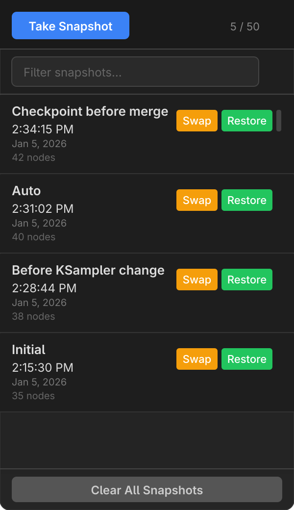
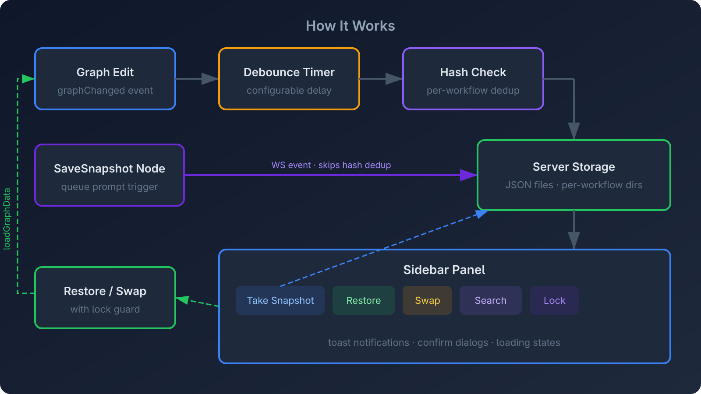

<p align="center">
  
</p>

<p align="center">
  <a href="https://registry.comfy.org/publishers/ethanfel/nodes/comfyui-snapshot-manager"></a>
  <a href="LICENSE"></a>
  
  
</p>

---

**Workflow Snapshot Manager** automatically captures your ComfyUI workflow as you edit. Browse, name, search, and restore any previous version from a sidebar panel — stored as JSON files on the server, accessible from any browser.

<p align="center">
  
</p>

## Features

- **Quieter auto-capture** — Meaningful edits are saved after a debounce and a configurable minimum interval; layout-only changes wait for the next real checkpoint
- **Truthful save status** — The sidebar says whether the graph is saved, pending, layout-only, paused, loading, or failed
- **Custom naming** — Name your snapshots when taking them manually ("Before merge", "Working v2", etc.); double-click a snapshot's name in the sidebar to rename it later
- **Notes** — Attach a freeform note to any snapshot with the note (pencil) button; notes are searchable from the filter bar
- **Search & filter** — Quickly find snapshots by name or note with the filter bar
- **Open Copy or Replace** — Open a snapshot in a separate workflow tab, or replace the current tab after a verified return point is saved
- **Workflow browser** — Browse and recover snapshots from any workflow, including renamed or deleted ones
- **Per-workflow storage** — Each workflow has its own independent snapshot history
- **Theme-aware UI** — Adapts to light and dark ComfyUI themes
- **Toast notifications** — Visual feedback for save, restore, and error operations
- **SaveSnapshot node** — Trigger snapshot captures from your workflow with a custom node; node snapshots are visually distinct (purple border + "Node" badge) and have their own rolling limit
- **Change-type icons** — Timeline markers show what kind of change each snapshot represents (node add, remove, connection, parameter, move, mixed) with distinct colored icons — like Fusion 360's operation timeline
- **Timeline bar** — Optional centered floating bar on the canvas showing all snapshots as iconic markers, with a Snapshot button for quick captures; tucks behind the sidebar when open
- **Active & return markers** — After replacing the graph, the timeline highlights the loaded snapshot (white ring) and the return point (green dot)
- **Verified return point** — Replace/Open Copy abort if the current graph cannot be protected first
- **Ctrl+S shortcut** — Press Ctrl+S (or Cmd+S on Mac) to take a manual snapshot alongside ComfyUI's own save
- **SVG graph previews** — Hover any snapshot for a tooltip preview of the workflow graph; click the eye button for a full-size modal; diff view now shows side-by-side SVG comparison with color-coded highlights (green = added, red = removed, amber = modified)
- **Diff view** — Compare any snapshot against the current workflow (one click) or two snapshots against each other (Shift+click to set base); see added/removed/modified nodes, widget value changes, and rewired connections in a single modal
- **Profile manager** — Save and load named sets of workflows as session profiles; new profiles pin exact snapshot IDs so their contents do not drift
- **Hide auto-saves** — The persistent filter hides auto history while keeping manual, locked, return-point, and node-triggered snapshots visible
- **Pause auto-capture** — Pause/resume from the panel; pausing cancels any pending timer and stays synchronized with the setting
- **Export / Import** — Download a workflow's full snapshot history as a JSON file and re-import it on another machine or server
- **Storage usage** — The sidebar footer shows total snapshot storage used on the server across all workflows
- **Retention by age** — Optionally auto-delete snapshots older than a configurable number of days (off by default), alongside the per-workflow count limit
- **Lock/pin snapshots** — Protect important snapshots from auto-pruning and "Clear All" with a single click
- **Concurrency-safe** — Lock guard prevents double-click issues during restore
- **Server-side storage** — Snapshots persist on the ComfyUI server's filesystem, accessible from any browser
- **Automatic migration** — Existing IndexedDB snapshots are imported to the server on first load

## Installation

### ComfyUI Manager (Recommended)

Search for **Workflow Snapshot Manager** in [ComfyUI Manager](https://github.com/ltdrdata/ComfyUI-Manager) and click Install.

### Git Clone

```bash
cd ComfyUI/custom_nodes
git clone https://github.com/ethanfel/Comfyui-Workflow-Snapshot-Manager.git
```

Restart ComfyUI after installing.

## Usage

### 1. Open the Sidebar

Click the **clock icon** () in the ComfyUI sidebar to open the Snapshots panel.

### 2. Snapshots are Captured Automatically

As you edit, meaningful changes are saved after a short quiet period (default: 3 seconds), with at least 60 seconds between automatic snapshots by default. Repositioning or resizing nodes alone does not create an entry; that layout rides with the next meaningful or manual checkpoint. An initial snapshot is created only when a workflow has no history.

The status line at the top of the sidebar always describes the live graph: saved, pending, layout-only, paused, loading, or failed.

### 3. Take a Named Snapshot

Click **Take Snapshot** to manually save the current state. A prompt lets you enter a custom name — great for checkpoints like "Before refactor" or "Working config".

### 4. Search & Filter

Use the filter bar at the top of the panel to search snapshots by name. The clear button (**&times;**) resets the filter.

### 5. Open Copy or Replace

Each snapshot has action buttons:

| Button | Action |
|--------|--------|
| **Open Copy** | Opens the snapshot in a separate workflow tab |
| **Replace** | Replaces the graph in the current tab after saving a return point |
| **More (…)** | Preview, Diff, Add/Edit Note, Lock/Unlock, and Delete |

### 6. Lock / Pin Snapshots

Click the **padlock icon** on any snapshot to lock it. Locked snapshots are protected from:

- **Auto-pruning** — When the snapshot count exceeds the max, only unlocked snapshots are pruned
- **Clear All** — Locked snapshots survive bulk deletion (the toast reports how many were kept)

To unlock, click the padlock again. Deleting a locked snapshot individually is still possible but requires confirmation.

### 7. Browse Other Workflows

Click the **workflow name** below the header to expand the workflow picker. It lists every workflow that has snapshots in the database, with counts. Click any workflow to view its snapshots — an amber banner confirms you're viewing a different workflow, and "Take Snapshot" is disabled to avoid confusion. Click **Back to current** to return.

This is especially useful for recovering snapshots from workflows that were renamed or deleted.

### 8. Timeline Bar

Enable the timeline in **Settings > Snapshot Manager > Timeline > Show snapshot timeline on canvas**. A centered floating bar appears at the bottom of the canvas with an iconic marker for each snapshot — each icon shows what kind of change the snapshot represents:

<p align="center">
  
</p>

| Icon | Color | Change Type |
|------|-------|-------------|
| Filled circle | Blue | **Initial** — first snapshot after load |
| Plus **+** | Green | **Node Add** — nodes were added |
| Minus **−** | Red | **Node Remove** — nodes were removed |
| Zigzag | Amber | **Connection** — links/wires changed |
| Wave | Purple | **Param** — widget values changed |
| Arrows ↕ | Gray | **Move** — nodes repositioned |
| Star ✱ | Orange | **Mixed** — multiple change types |
| Faded dot | Gray | **Unknown** — legacy snapshot or no detected change |

Additional marker styles are layered on top of the change-type icon:

| Overlay | Meaning |
|---------|---------|
| **Purple background** | Node-triggered snapshot (overrides change-type color) |
| **Yellow border** | Locked snapshot |
| **White ring (larger)** | Active — the snapshot you swapped TO |
| **Green background** | Return point — the protected state from before Replace/Open Copy |

Click any marker to replace the current graph with that snapshot. Hover to see a tooltip with the snapshot name, time, and change description. The **Snapshot** button on the right takes a quick manual snapshot. The bar is centered at 80% width to clear both the sidebar icon strip and bottom-right controls, and tucks behind the sidebar panel when it's open.

The sidebar list also shows the change type in the meta line below each snapshot (e.g., "5 nodes · Parameters changed").

### 9. Return Point Before Replace

Before Open Copy or Replace changes workflow navigation, the extension saves a typed **Return point** of your current graph. If that write fails, the requested action is cancelled. The green timeline marker identifies the return point; the white ring identifies the loaded snapshot.

### 10. Keyboard Shortcut

Press **Ctrl+S** (or **Cmd+S** on Mac) to take a manual snapshot. This works alongside ComfyUI's own workflow save — both fire simultaneously.

### 11. Delete & Clear

- Click **&times;** on any snapshot to delete it individually (locked snapshots prompt for confirmation)
- Click **Clear All Snapshots** in the footer to remove all unlocked snapshots for the current workflow (locked snapshots are preserved)

### 12. Diff View

Compare two snapshots — or a snapshot against the current workflow — to see exactly what changed without touching the graph.

**One-click (vs current workflow):** Click **Diff** on any snapshot to see what changed between that snapshot and your current live workflow.

**Two-snapshot compare:** **Shift+click** **Diff** on snapshot A to set it as the base (purple outline + toast confirmation), then click **Diff** on snapshot B to compare A → B. The base clears after comparison.

The diff modal shows:

| Section | Details |
|---------|---------|
| **SVG comparison** | Side-by-side graph previews at the top — base on the left, target on the right, with highlighted nodes (green = added, red = removed, amber = modified) |
| **Summary pills** | Colored counts — green (added), red (removed), amber (modified), blue (links) |
| **Added Nodes** | Nodes present in the target but not the base |
| **Removed Nodes** | Nodes present in the base but not the target |
| **Modified Nodes** | Nodes with changed position, size, title, mode, widget values, or properties — each change shown as old (red strikethrough) → new (green) |
| **Link Changes** | Added/removed connections with node names and slot indices |
| **Group Changes** | Added, removed, renamed, moved, or restyled graph groups |

Sections are collapsible (click the header to toggle). If the two snapshots are identical, a "No differences found." message is shown. Dismiss the modal with **Escape**, the **X** button, or by clicking outside.

### 13. SVG Graph Previews

Visually inspect any snapshot without restoring or swapping it.

**Hover tooltip:** Hover over any snapshot in the sidebar list. After 200ms, a small SVG preview appears next to the item showing the graph layout with nodes, links, and groups. Move the mouse away to dismiss.

**Preview modal:** Click the **eye button** on any snapshot to open a full-size preview modal showing the complete graph with node titles, colored link beziers, input/output slot dots, and group overlays. Dismiss with **Escape**, the **X** button, or by clicking outside.

The SVG renderer draws nodes with their stored position, size, and colors. Links are rendered as bezier curves colored by type (blue for IMAGE, orange for CLIP, purple for MODEL, etc.). Collapsed nodes appear as thin title-only strips. Thumbnails (hover tooltips) auto-simplify by hiding labels and slot dots for clarity at small sizes.

### 14. Hide Auto-saves

Click the **Hide Auto** button next to the search bar to hide all auto-save snapshots ("Auto" and "Initial"). The choice persists when the sidebar or ComfyUI is reopened. The button turns blue and switches to **Show Auto** when active.

The filter works together with text search — both are applied simultaneously. Manual, locked, node-triggered, and return-point snapshots are always shown.

### 15. Session Profiles

Save and load named sets of workflows — like browser tab groups for ComfyUI.

**Save a profile:**

1. Click the **`>`** Profiles toggle between the workflow picker and search bar to expand
2. Click **Save** — enter a profile name
3. The profile captures all workflows you've visited in this session

**Load a profile:**

1. Expand the Profiles section
2. Click **Load** on any profile — the extension opens the exact snapshot saved for each workflow (legacy profiles fall back to the latest snapshot)
3. The profile's active workflow is loaded last so it ends up visible
4. A toast reports how many workflows were loaded and how many were skipped (missing snapshots)

**Delete a profile:** Click **X** on any profile (with confirmation).

Profiles are stored as JSON files on the server at `<user_dir>/snapshot_manager/profiles/`.

## Settings

All settings are available in **ComfyUI Settings > Snapshot Manager**:

| Setting | Type | Default | Description |
|---------|------|---------|-------------|
| **Auto-capture on edit** | Toggle | `On` | Automatically save snapshots when the workflow changes |
| **Capture delay** | Slider | `3s` | Seconds to wait after the last edit before auto-capturing (1–30s) |
| **Minimum time between auto-snapshots** | Slider | `60s` | Prevent rapid edits from producing a wall of automatic entries (0–300s) |
| **Max snapshots per workflow** | Slider | `50` | Maximum number of unlocked snapshots kept per workflow (5–200). Oldest unlocked are pruned automatically; locked snapshots are never pruned |
| **Initial snapshot for new workflows** | Toggle | `On` | Save an "Initial" snapshot only when the workflow has no history |
| **Max node-triggered snapshots** | Slider | `5` | Rolling limit for SaveSnapshot node captures per workflow (1–50). Node snapshots are pruned independently from auto/manual snapshots |
| **Auto-delete by age** | Slider | `0` | Delete old unlocked snapshots after this many days; 0 disables age pruning |
| **Show snapshot timeline** | Toggle | `Off` | Display a timeline bar with snapshot markers, active/return-point indicators, and a quick Snapshot button |

## Architecture

<p align="center">
  
</p>

**Auto/manual capture flow:**

1. **Graph edits** trigger a `graphChanged` event
2. A **debounce and minimum interval** prevent bursty writes; pausing cancels a pending timer
3. The workflow is serialized and **structurally compared** against the last capture to avoid duplicate and layout-only auto history
4. The previous graph state is diffed against the current to **detect the change type** (node add/remove, connection, parameter, move, or mixed) — stored as a `changeType` field on the record
5. New snapshots are sent to the **server** and stored as individual JSON files under `<user_dir>/snapshot_manager/snapshots/`
6. The **sidebar panel** and **timeline bar** fetch snapshots from the server and render them with change-type icons
7. **Open Copy/Replace** first verifies a return-point write, then loads graph data with a lock guard and resets the live comparison baseline

**Node-triggered capture flow:**

1. **SaveSnapshot node** executes during a queue prompt run
2. A **WebSocket event** is sent to the frontend, **skipping hash dedup** (the workflow doesn't change between runs)
3. The snapshot is saved with `source: "node"` and pruned against its own rolling limit (`maxNodeSnapshots`)
4. Node snapshots appear in the sidebar with a **purple left border** and **"Node" badge**

**Replace with a return point:**

1. User clicks **Replace** (sidebar or timeline marker)
2. `captureSnapshot("Return point")` completes **before** the graph is changed; failure aborts the action
3. The target snapshot is loaded into the graph
4. The **timeline** updates: the loaded snapshot gets a white ring and the return point gets a green dot
5. Clicking the green dot replaces the graph with the protected return point

**Branching** (implemented but disabled in the current release — the code remains for a future enable):

1. Each snapshot stores a `parentId` pointing to its predecessor
2. `buildSnapshotTree()` constructs parent/child maps from all records — legacy snapshots (no `parentId`) are chained by timestamp automatically
3. `getDisplayPath()` walks the tree from root to tip, following `activeBranchSelections` at each fork point, producing the linear branch view
4. **Pruning protection**: before pruning, `getAncestorIds()` collects all ancestors of the branch tip; these IDs plus fork-point IDs are sent as `protectedIds` to the server

**Profiles:**

1. Session tracking records each visited workflow key with timestamps
2. **Save** records the exact snapshot ID for each workflow plus the active workflow
3. **Load** opens those pinned snapshots in workflow tabs; legacy profiles without IDs use the latest available snapshot

**Storage:** Snapshots are stored as JSON files on the server in ComfyUI's user directory at `<user_dir>/snapshot_manager/snapshots/<workflow_key>/<id>.json`. Profiles are stored at `<user_dir>/snapshot_manager/profiles/<id>.json`. Data from older versions (kept under the extension's own `data/` folder) is migrated here automatically on first load. Both persist across browser sessions, ComfyUI restarts, and are accessible from any browser connecting to the same server.

## FAQ

**Where are snapshots stored?**
On the server's filesystem in ComfyUI's user directory under `snapshot_manager/snapshots/`. Each workflow gets its own directory, and each snapshot is an individual JSON file. They persist across browser sessions and are accessible from any browser connecting to the same ComfyUI server.

**I'm upgrading from v1.x — what happens to my existing snapshots?**
On first load after upgrading, the extension automatically migrates all snapshots from your browser's IndexedDB to the server. Once migration succeeds, the old IndexedDB database is deleted. If migration fails (e.g., server unreachable), your old data is preserved and migration will retry on the next load.

**Will this slow down ComfyUI?**
Snapshots are captured asynchronously after a debounce and minimum interval. Structural comparison prevents duplicate and layout-only automatic writes.

**What happens if I switch workflows?**
Each workflow has its own snapshot history. If an edit is still waiting on its debounce when you switch, that graph is frozen and queued under the workflow you left, then the sidebar follows the new workflow. You can browse other histories with the workflow picker.

**I renamed/deleted a workflow — are my snapshots gone?**
No. Snapshots are keyed by the workflow name at capture time. Use the workflow picker to find and restore them under the old name.

**What are profiles?**
Profiles save exact snapshots for workflows visited in a session. Loading a profile opens those pinned states, so a profile does not change merely because newer autosaves were created later.

**Can I use this with ComfyUI Manager?**
Yes — install via ComfyUI Manager or clone the repo into `custom_nodes/`.

## License

[MIT](LICENSE)
